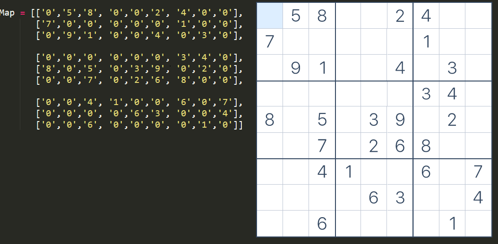
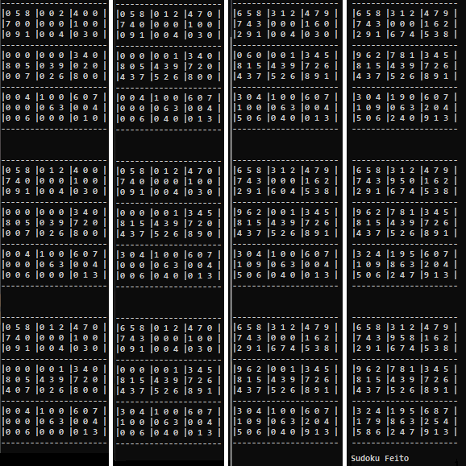
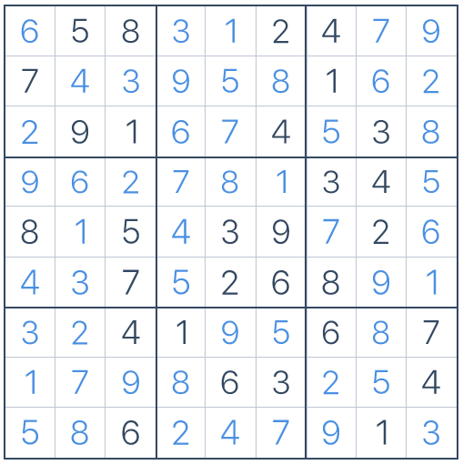

# Sudoku Solver

**This Sudoku Solver, was Built to only work on easy to High dificulty!**
**Didnt manage to make them work on Expert Mode since i lack the skill to solve them my self!**

[Sudoku](https://sudoku.com) **WebSite used to play Sudoku**

## How To Use

To start the Program, first you must need to enter yourself the numbers of the sudoku in the Map Array!

After that you just need to run the code and you will get all the steps that the program used to solve the sudoku.

And the solved sudoku will be presented in a couple of seconds!
### To show that all the values match

And its all you need to get the Sudoku Solved!
